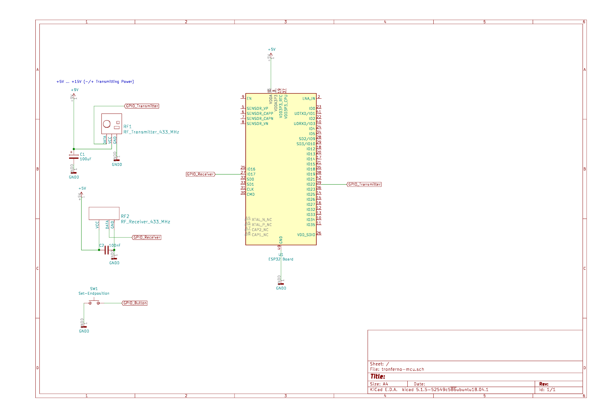

#### RF Hardware

  * 433 MHz RF transmitter (like FS1000A) to send commands.

  * Optional 433 MHz RF receiver (like RXB6) to receive commands.

  * Please note, a super-regeneration receiver can disturb other
receivers. This is the reason you should not place some 433 MHz power plugs near your 433 MHz shutter. A
super-heterodyne receiver, like the RXB6, does not have this issue.

#### MCU boards

##### ESP32

  * Recommended: ESP32, 4MB FLASH, WLAN
  * Note: the optional Ethernet functionality is implemented different on different boards (may even be different on different revisions of the same board).
  * Ethernet is working and tested on:
       * Olimex ESP32-Gateway Rev. E
  * SDK/toolchain: esp-idf/cmake

##### ESP8266
  * Still supported but missing features
  * Tested on: ESP8266 board with 4MB flash-ROM.
  * SDK/Toolchain: ESP8266_NONOS_SDK (+ libm.a from esp-open-sdk)

##### AVR ATMEGA328P (on "Nano" board)
  * only basic functionality
  * firmware compiles (but too big to load) with: git checkout 80043d2e0bd5bd94be9053207e2fcf5aea391c71
  * firware compiles and runs fine with: git checkout e29af9767c6492f66b1fe99637737d14fd82d5b9
  * SDK/toolchain: avr-libc, avr-gcc, avrispII programmer hardware with avrdude

#### More Info
  * [GPIO pin numbers](pins.md)
  * [Schematic](schematic.pdf)

