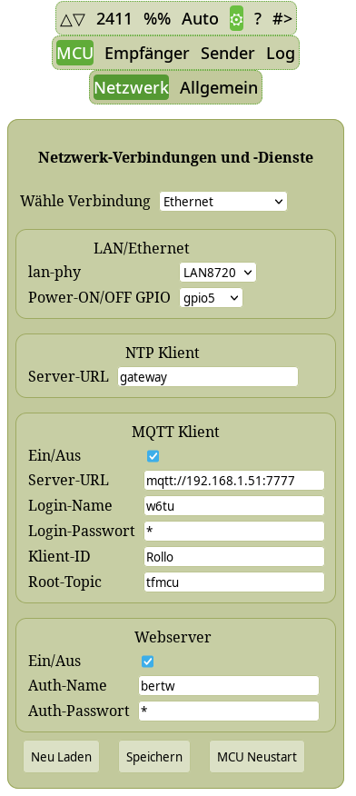

### Mit WLAN Access-Point verbinden für die erstmalige Konfiguration (oder zur Reparatur der Netzwerkverbindung)
* aktiv nach dem ersten flashen (und wenn die Verbindung zum konfigurierten Netzwerk fehlschlägt)
* Verbinden deinen Laptop oder Smartphone mit dem Tronferno-WLAN-Asccesspoint: SSID=tronferno, WLAN-Passwort: tronferno
* Nach dem Verbinden öffne die Tronferno-Weboberfläche [http://192.168.4.1](http://192.168.4.1) in einem Browser.
* Nun richte die Netzwerkverbindung über die Weboberfläche ein
* Vergesse dabei nicht, auch den <strong>Webserver zu aktivieren</strong>.

### Tronferno einrichten zum Verbinden mit WLAN Router
* Einrichten über Weboberfläche
  * Navigation: Zahnrad->MCU->Netzwerk
     * Der Sprechblasen-Hilfe für die Optionen folgen (Mouseover oder Touch der Option-Namen)
     * Verbindung: "Existing WLAN"
     * WLAN-Station->SSID: Die SSID deines WLANs
     * WLAN-Station->Passwort: Das Passwort deines WLANs
     * Webserver->Ein/Aus: Webserver hier einschalten um die Weboberfläche später nutzen zu können
* Einrichten über [Kommandozeilenoptionen](mcu_config_cli-de.md)
  * <pre>config network=wlan wlan-user=XXX wlan-password=XXX http-enable=1;</pre>

### Tronferno einrichten zum verbinden mit LAN (Ethernet)
* Einrichten über Weboberfläche
  * Navigation: Zahnrad->MCU->Netzwerk
     * Der Sprechblasen-Hilfe für die Optionen folgen (Mouseover oder Touch der Option-Namen)
     * Verbindung: "Ethernet"
     * LAN/Ethernet->lan-phy: LAN8720 ist getestet (ungetestet: RTL8201, IP101)
     * LAN/Ethernet->Power-ON/OFF-GPIO: boardabhängig, dieser GPIO schaltet die Stromversorgung für Ethernet auf dem Board ein/aus.
     * Webserver->Ein/Aus: Webserver hier einschalten um die Weboberfläche später nutzen zu können
* Einrichten über [Kommandozeilenoptionen](mcu_config_cli-de.md)
  * <pre>config network=lan lan-phy=lan8720 lan-pwr-gpio=-1 http-enable=1;</pre>
  

### Webserver einrichten
  * Einrichten über Weboberfläche:
     * Navigation: Zahnrad->MCU->Netzwerk
       * Der Sprechblasen-Hilfe für die Optionen folgen (Mouseover oder Touch der Option-Namen)
  * Einrichten über [Kommandozeilenoptionen](mcu_config_cli-de.md)
     * <pre>config http-enable=1 http-user=XXX http-password=XXX;</pre>
 
### MQTT Klient einrichten
  * Einrichten über Weboberfläche:
     * Navigation: Zahnrad->MCU->Netzwerk
            * Der Sprechblasen-Hilfe für die Optionen folgen (Mouseover oder Touch der Option-Namen)
  * Einrichten über [Kommandozeilenoptionen](mcu_config_cli-de.md)
     * <pre>config mqtt-enable=1 mqtt-url="mqtt://192.168.1.XX:1883" mqtt-user=XXX mqtt-password=XXX mqtt-root-topic=tfmcu mqtt-client-id=Rollo;</pre>
  
#### Mehr Info
  * [MCU configuration](mcu_config.md)

  
------------

